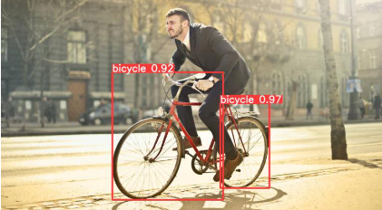
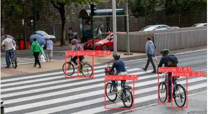
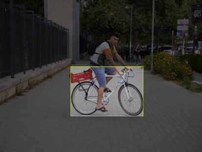
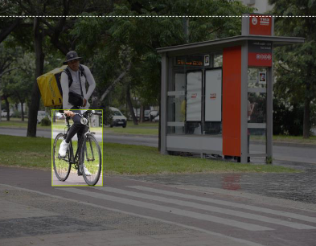
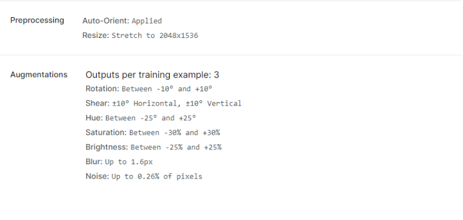
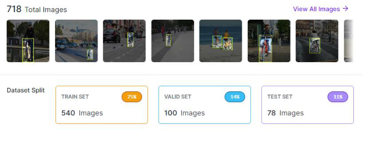
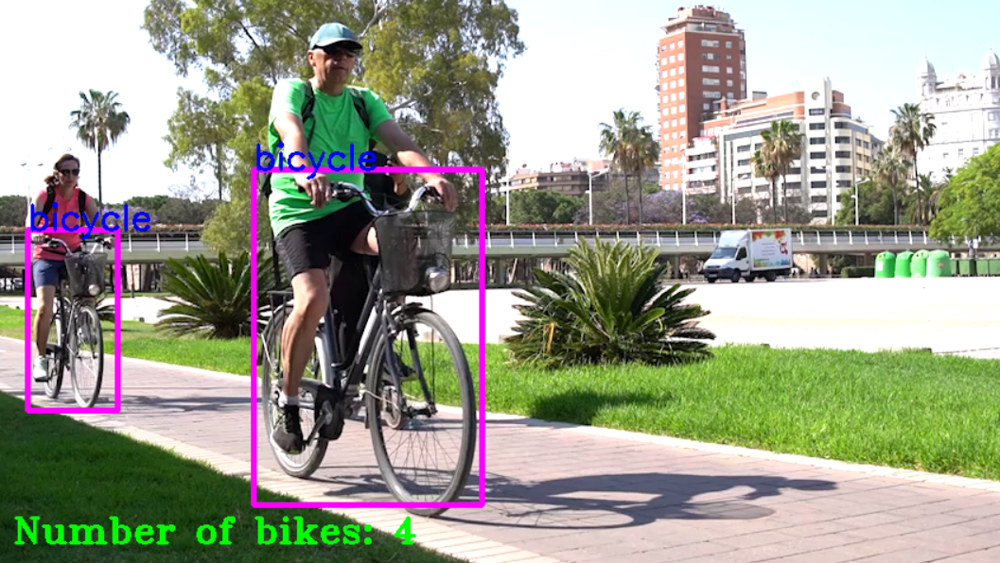
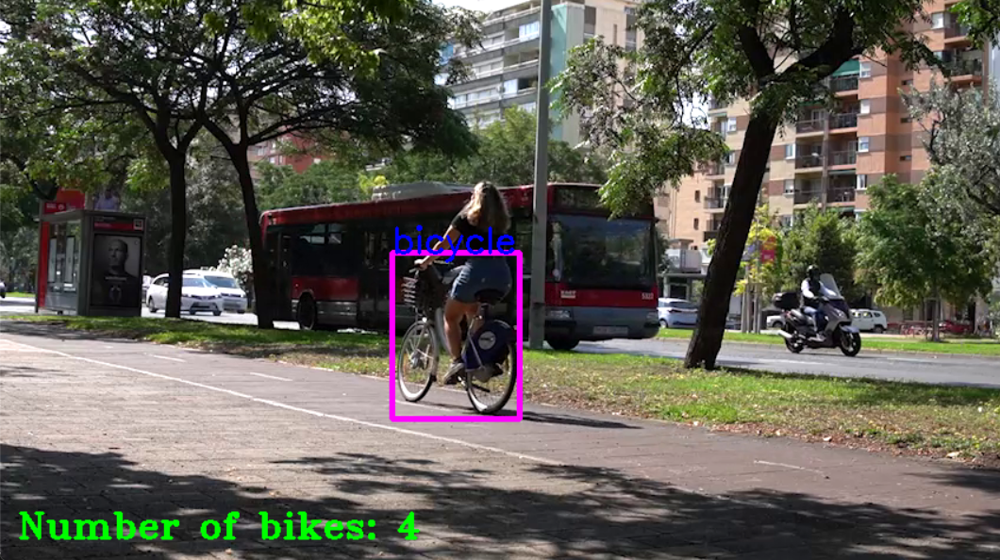
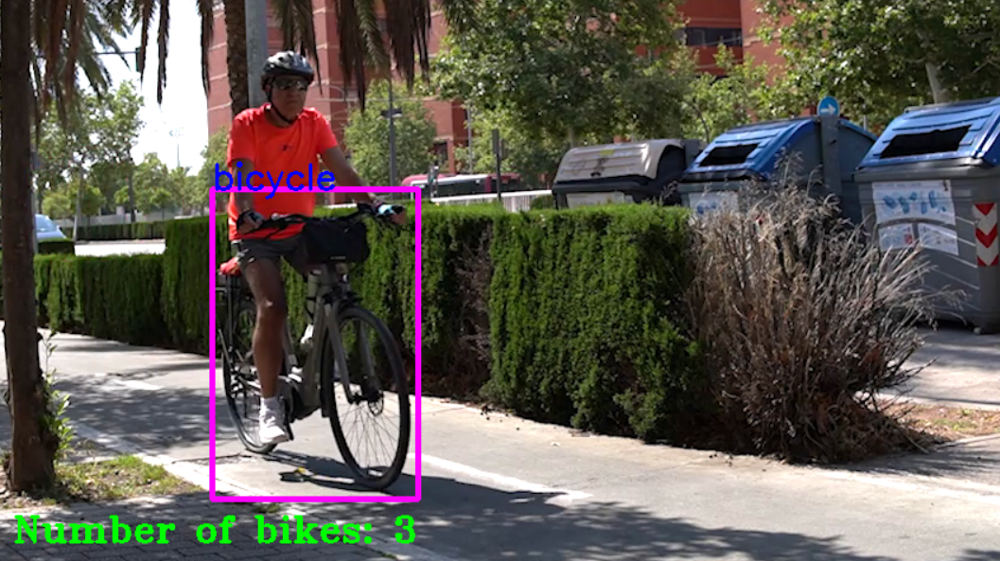
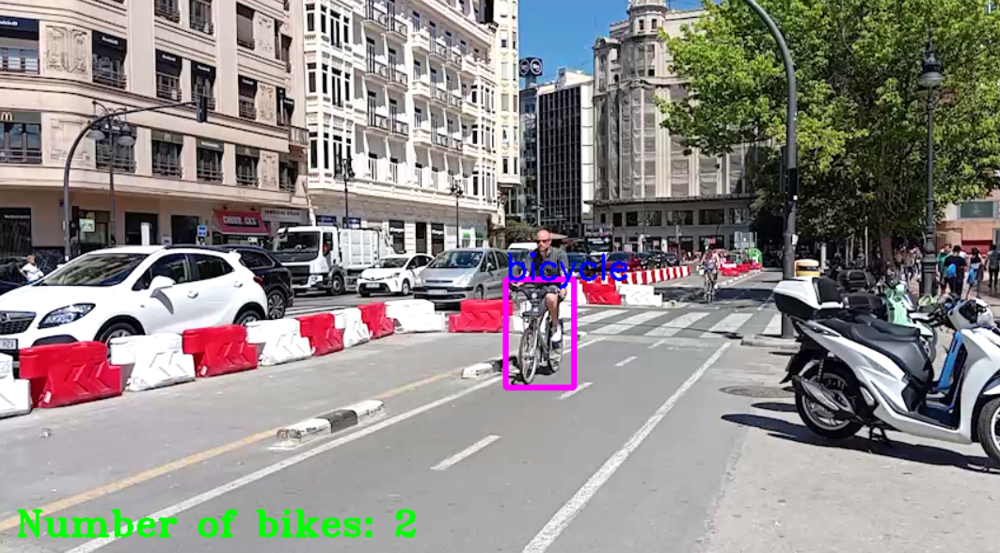

# Bike Counter with Yolo-v8 and OpenCV
### Objectives:

Create a program using deep learning techniques to identify and count bicycles appearing in a video.

### Procedure:

After some research, I decided to use the `Ultralytics Yolo` algorithm, which is very popular in computer vision, especially for object detection and segmentation.

First, I decided to train a model using public datasets from Kaggle. However, the results weren't very good - while it detected bicycles, it got confused when people were riding them, often detecting one bicycle per wheel, as shown in these images:

<div style="display: flex; justify-content: space-between;">
    
    
</div>

I ran several tests changing training parameters like epochs or batch size, but the problem persisted. So, I decided to create and label my own dataset for better results.

I downloaded many photos from the internet showing people riding bicycles. I tried to make them as diverse as possible, including all types of bicycles and varying image quality, exposure, saturation, contrast...

Additionally, for higher quality photos, I went out with my camera through Valencia's streets and positioned myself near busy bike lanes to photograph as many bikes as possible. Again, I tried capturing various conditions for a better quality dataset.

Finally, I gathered 353 photos. Using Roboflow, I labeled them by marking rectangles around the bicycles.

<div style="display: flex; justify-content: space-between;">
    
    
</div>

Furthermore, using Roboflow, I applied data augmentation to my dataset, effectively tripling the data by applying transformations like rotations, scaling, changes in saturation and exposure...



I then divided the images into 3 groups:
- Training images (train): used exclusively for model training
- Validation images (validation): used to prevent overfitting and adjust hyperparameters
- Test images (test): used to evaluate model performance after training



After completing my dataset, I could download it in a format suitable for YOLOv8, with folders containing the divided images and labels in .txt format with information about bicycle bounding boxes.

### Training:

I used Google Colab for training since it provides access to a more powerful GPU for faster processing.

***Here's the code used:***

The ultralytics library provides access to the YOLO detection model:

```python
# Import ultralytics
import ultralytics
```

This command accesses files stored in Google Drive, like our dataset:

```python
# Mount Google Drive
from google.colab import drive
drive.mount('/content/drive')
```

The following command trains our model. We specify detection training using the yolov8n model ('n' for "nano" - a lighter version with fewer layers and parameters for faster processing). We specify the dataset path and where to save training results.

After several tests, I got better results with 20 epochs and batch size of 16 images:

```python
!yolo task=detect mode=train model=yolov8n.pt data="/content/drive/MyDrive/Detector de bicicletas/Dataset_Jorge/data.yaml" epochs=20 imgsz=800 batch=16 project="/content/drive/MyDrive/yolov8/training_results" name=bicycle_v8
```

After training completes, it generates a .pt (PyTorch) file containing our model's neural network weights.

### Implementation:

Next, I'll explain the code programmed to count bicycles in a video, using the OpenCV library and the weights generated during training. 

Similar to before, we import the necessary libraries:

```python
from ultralytics import YOLO
import cv2
```

We store the video in a variable and verify it opens correctly:

```python
# Save the video in a variable
cap = cv2.VideoCapture(path)

# Verify if the video opened correctly
if not cap.isOpened():
    print("Error: Cannot open video.")
```

We import our previously trained model and initialize necessary variables like confidence threshold and history frame length:

```python
model = YOLO("pesos_dataset_jorge.pt")

# Classes
classNames = ["bicycle"]

# Confidence threshold
confidence_threshold = 0.7

# Bicycle counter
bike_count = 0

# Position history for smoother tracking
history = []
history_length = 10  # number of frames to keep in history
iou_threshold = 0.15  # IoU threshold to consider same bicycle
```

We define the function to calculate Intersection over Union (IOU). This function takes bounding boxes from two different frames as parameters (coordinates of top-left and bottom-right corners). It calculates the intersection area and each box's area to return the IOU value, which is 1 if boxes are in exactly the same position and 0 if there's no intersection:

```python
# Function to calculate Intersection over Union
def calculate_iou(boxA, boxB):
    xA = max(boxA[0], boxB[0])
    yA = max(boxA[1], boxB[1])
    xB = min(boxA[2], boxB[2])
    yB = min(boxA[3], boxB[3])

    interArea = max(0, xB - xA + 1) * max(0, yB - yA + 1)
    boxAArea = (boxA[2] - boxA[0] + 1) * (boxA[3] - boxA[1] + 1)
    boxBArea = (boxB[2] - boxB[0] + 1) * (boxB[3] - boxB[1] + 1)

    iou = interArea / float(boxAArea + boxBArea - interArea)
    return iou
```

Now we initialize the loop that processes the video frame by frame and detects bicycles:

```python
while cap.isOpened():
    try:
        success, img = cap.read() 
        if not success:
            break
```

We increase exposure to avoid errors:

```python
img = cv2.convertScaleAbs(img, alpha=1.15)
```

We pass each frame through our model for bicycle detection and process the results. Using OpenCV, we draw a box around each bicycle if it exceeds the confidence threshold:

```python
results = model(img, stream=True)

for r in results:
    boxes = r.boxes
    for box in boxes:
        x1, y1, x2, y2 = box.xyxy[0]
        x1, y1, x2, y2 = int(x1), int(y1), int(x2), int(y2)

        confidence = box.conf[0]
        if confidence < confidence_threshold:
            continue

        cls = int(box.cls[0])
        current_positions.append((x1, y1, x2, y2))

        cv2.rectangle(img, (x1, y1), (x2, y2), (255, 0, 255), 3)
        cv2.putText(img, classNames[cls], (x1, y1), cv2.FONT_HERSHEY_SIMPLEX, 1, (255, 0, 0), 2)
```

Next, we compare detected bicycle positions with history and calculate IOU. If it exceeds the defined threshold, it considers it's the same bicycle. Finally, it updates position history:

```python
# Compare positions and update counter
for current_pos in current_positions:
    new_bike = True
    for history_frame in history:
        for prev_pos in history_frame:
            if calculate_iou(current_pos, prev_pos) > iou_threshold:
                new_bike = False
                break
        if not new_bike:
            break
    if new_bike:
        bike_count += 1

history.append(current_positions)
if len(history) > history_length:
    history.pop(0)
```

Finally, we display the bicycle counter and set an exit command:

```python
cv2.putText(img, f"Number of bikes: {bike_count}", (15, 460), cv2.FONT_HERSHEY_TRIPLEX, 1, (0, 255,0), 2)
cv2.imshow('Video', img)

if cv2.waitKey(1) == ord('q'):
    break

cap.release()
cv2.destroyAllWindows()
```

### bResults: 

As we can see, the program performs quite well even if the lighting conditions are not ideal, being able to detect and count bicycles in videos with high contrast between lights and shadows.

- Video 1:



- Video 2:



- Video 3:



- Video 4:




### References:

- [YOLOv8 by Ultralytics](https://github.com/ultralytics/ultralytics)
- [Roboflow](https://roboflow.com/)
- [Intersection over Union (IoU) Explained](https://www.pyimagesearch.com/2016/11/07/intersection-over-union-iou-for-object-detection/)
- [Real-time Object Detection with YOLO and Webcam](https://dipankarmedh1.medium.com/real-time-object-detection-with-yolo-and-webcam-enhancing-your-computer-vision-skills-861b97c78993)
